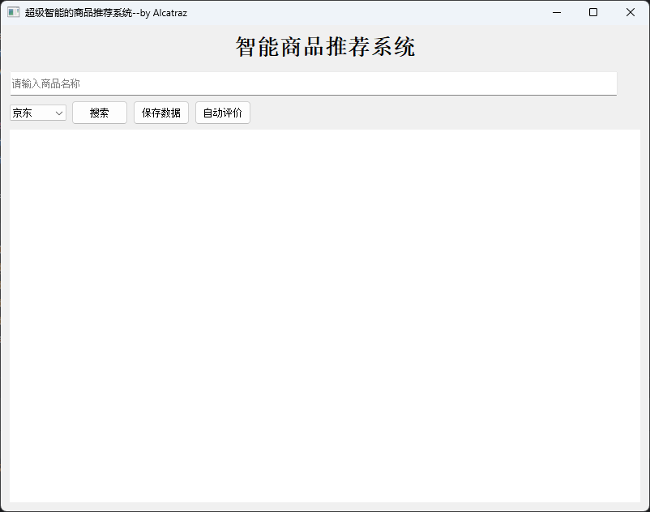
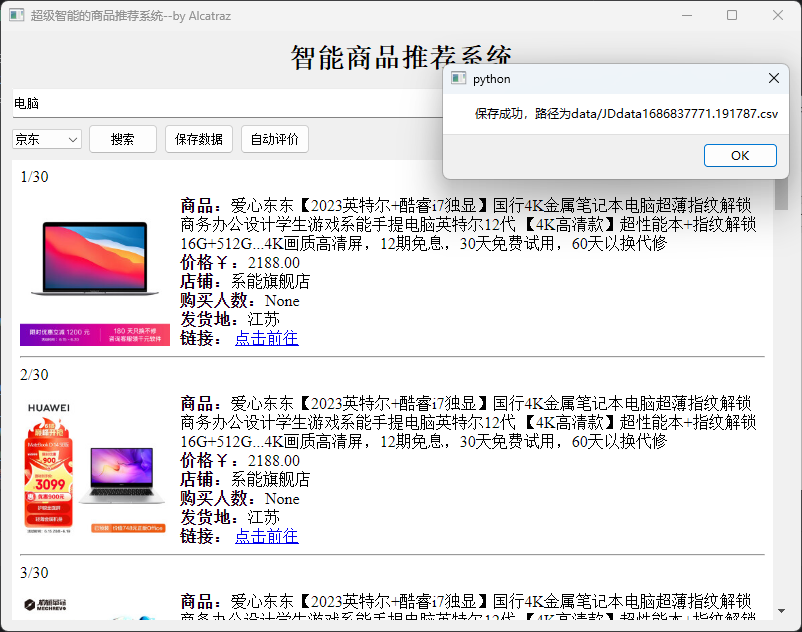
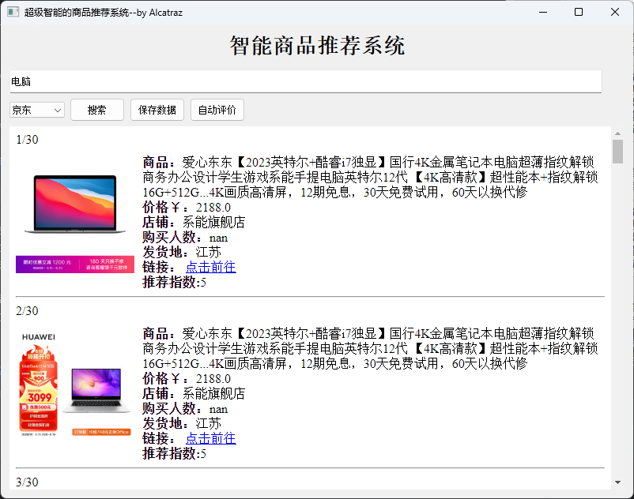
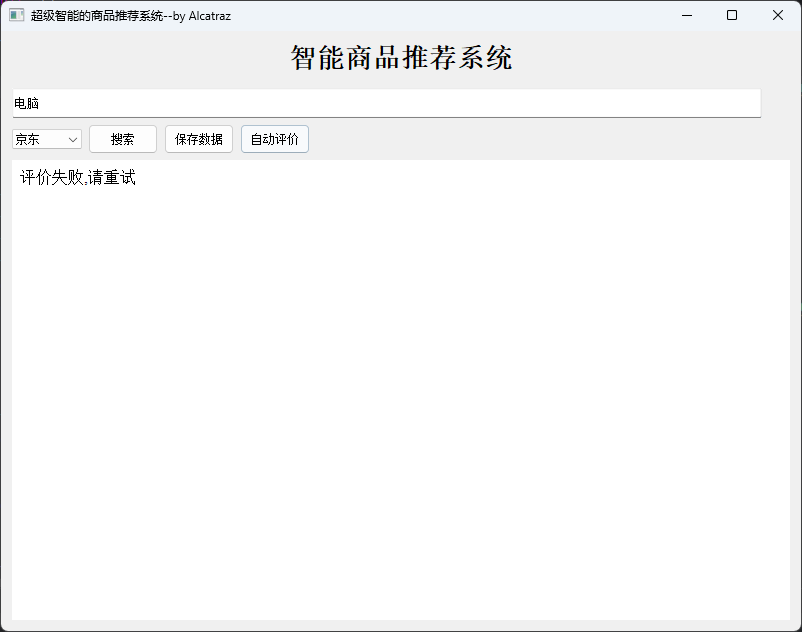

# 淘宝、京东商品爬虫及评价系统
## 1. 使用说明
1. 安装项目所依赖的库  
  打开项目所在文件夹，进入Terminal，输入  
  
    ```Terminal
    pip install -r requirements.txt
    ```
2. 从文件夹进入Terminal（文件路径处输入：cmd）  
3. 在Terminal中输入：
   ```Terminal
    Python main.py
   ```
4. 成功运行后的界面如下：

5. 使用方法：在输入框中输入商品名称，然后在左侧下拉框中选择平台（京东/淘宝），点击搜索即可得到搜索结果。在搜索完成以后可以点击保存数据，系统会自动将数据保存在data文件夹中，并且会弹出保存成功的提示，具体如下图。

由于电商网站的反爬比较严重，可能会有请求被反爬程序拦截的问题，此时程序可能会意外退出。遇到此类情况，请在Spider.py文件中的‘def __init__(self, url, timeout):’中的'self.headers'里替换自己的cookies后重试。  


6. 关于自动评价的用法：自动评价是基于商品的商家信息和商品的评论自动给出推荐等级的方法，具体的算法看请看后面部分的说明。使用方法为在加载完数据后点击自动评价。  
若评价成功（正常情况下）,界面会刷新，并在原来商品的页面下方新增一行：推荐指数。  
推荐指数有5个档次，分别是1、2、3、4、5，越大则是从算法角度来说越好的商品。  

当然由于网站经常会有反爬虫或者数据未加载完全便进行评价的问题，也有可能会评价不成功，此时会显示  

如果显示不成功，建议等待片刻后再次点击“自动评价”，如果仍然不成功，建议重新搜索后等待片刻再使用“自动评价”。若前两种方法均不能成功，请更改关键词或平台尝试。
## 2. 我的想法
为什么我会想做这个系统？  
现在在网上购物是在是太难挑了，所以我基本选择不购物，但是有时候真的需要购物时如何快速的对比商品之间谁更加值得购买呢？
我想结合自己的购物挑选物品的习惯将爬虫技术与NLP（其实不能算NLP吧，本次项目我仅仅使用了LSTM对商品的评论进行分类） ，实现购物的快速预比对。  
当然了，这只是我自己写来做测试的，后续我自己是不是会使用本程序进行物品挑选也还是未可知，如本程序出现任何问题而对您的购物
产生了任何不愉快的影响与我无关:yum: ^o^
## 3. 具体实现
### 3.0 文件结构
```commandline
- .idea
- __pycache__
- data
- img
+ Model
|  - data
|  - model
|  - test.py
|  - train.py
+ temp
|  + data
|  |  - JDdata.csv
|  |  - page.txt
|  |  - TBdata.csv
|  - img
|  - JD_comment
|  - TB_comment
- main.py
- Spider.py
- Evalution.py
- UI.py
- utils.py
- readme.md
- requirements.txt
```
本项目的文件结构如上所示。.idea和__pycache__均为pycharm配置环境时自动生成，不必理会。data文件夹用于存放点击“保存数据”存放的数据。img为本文件(readme.md)中图片的存放位置，
Model为LSTM模型的存放地址，Model/data为数据集，其中有多个数据集，部分是我自己的，还有一些是网上开源的数据集。Model/model中是已经训练好的模型和分词词典及索引，用于商品评价的分类，test.py为测试程序，train.py为训练程序
temp文件夹是程序的临时数据，每次进行搜索时会自动清理。data中是网页源码和京东、淘宝爬取完后的数据。img为商品图片，
JD_comment和TB_comment是京东和淘宝评论的存放文件夹。main.py是主程序，Spider.py是爬虫程序，Evaluation.py
是使用LSTM进行商品评论分类及对商品评分的程序，UI.py是整个界面的源代码，utils.py是一些程序所需要的工具函数，比如clear_folder，
readme.md为本文件，requirements.txt为本项目的依赖文件。
### 3.1 爬虫部分的实现
#### 3.1.1 URL部分
**1.淘宝**  
在淘宝搜索商品是，url的构成通常是
https://s.taobao.com/search?q= +keyword   
因此我们可以考虑在将前一部分'https://s.taobao.com/search?q=' 固定，然后将输入框的keyword加入url构成一个完整的淘宝链接。  
**2.京东**  
在京东搜索商品是，url的构成通常是
https://search.jd.com/Search?keyword= +keyword  
因此我们可以考虑将前一部分 'https://search.jd.com/Search?keyword=' 固定，然后将输入框的keyword加入url构成一个完整的京东链接
代码实现
```Python
    def search(self):
        Spider.clear_folder('temp/img')
        url_dict = {
            '京东': 'https://search.jd.com/Search?keyword=',
            '淘宝': 'https://s.taobao.com/search?q='
        }
        goods = quote(self.inputLine.text())
        platform = self.comboBox.currentText()
        url = url_dict.get(platform, None) + goods
```
#### 3.1.2 请求返回的数据
前面我们已经成功生成了url，使用get命令可以轻松获得淘宝或者京东网页的数据，当然，前提是需要有一个有效的cookies(在header中修改)
```Python
    def get_page(self):
        """获取网页源代码"""
        try:
            page = requests.get(self.url, headers=self.header, timeout=self.timeout)
            page.raise_for_status()
            with open('temp/data/page.txt', 'w', encoding='utf-8', errors='ignore') as f:
                f.write(page.text)
            print("成功获取信息！")
            return page.text
        except requests.exceptions.RequestException as err:
            print("获取信息失败！：", str(err))
            return None
```
得到返回的数据后，我们将它保存在（‘temp/data/page.txt')中，通过查看淘宝与京东返回的信息，我们可以使用数据处理工具得到我们所需要的信息。  
#### 3.1.3 处理返回的数据
淘宝返回的格式与京东返回的格式是不一样的，因此我们分开考虑  
**1. 淘宝**  
```json
g_page_config = {"pageName":"mainsrp","mods":{"shopcombotip":{"status":"hide"},"phonenav":{"status":"hide"},"debugbar":{"status":"hide"},"shopcombo":{"status":"hide"},"itemlist":{"status":"show","data":{"postFeeText":"运费","trace":"msrp_auction","auctions":  
[{"p4p":1,"p4pSameHeight":true,"nid":"667665852631","category":"50019780","categoryp":"50019780","pid":"","title":"【顺丰速发 12期免息】三星Samsung Galaxy Tab S8/S8+/S8 Ultra 系列平板\u003cspan class\u003dH\u003e电脑\u003c/span\u003e追剧智能2022新款学生学习办公","raw_title":"三星Samsung Galaxy Tab S8/S8+/S8 Ultra","pic_url":"//g-search1.alicdn.com/img/bao/uploaded/i4/imgextra/i2/15237275/O1CN01pT4wAN23c0EGYuBz8_!!0-saturn_solar.jpg","detail_url":"https://click.simba.taobao.com/cc_im?p\u003d%B5%E7%C4%D4\u0026s\u003d258036029\u0026k\u003d941\u0026e\u003d7MhVImNq06g4FU297ykXkL0lr8Y%2BWJnH2BSzT98RTKmCN0ks99GXa3%2BkNwBOgeUJ264aitxLH9Xs7C86hJXoc2Zuwt5lUHX8%2FvJhJiJ2j9NaaWVQ00QGKVXZPZ51zaOF83L0YmhDqENIZXKKqgcL8Uk%2BsXf%2FzuXHKJ101vM08FKtMegztztPKowLjr8NwZsaV3K2ZC%2FRHKPfFL9%2FXi0sjssMaZzMfFqmpUkGp0RWL7WLQX3h%2FvnxLVGn3W0uWPg0xKK0Ib9iLfNFMbAqedjepIwAT5fCOpCXxLcHJkEbXSQuuwibxsb899yGPEslrJ4m6EMo7qFbr4pGkLqW7bG5aGo0LWE3m6azH%2Fcxh4K5P7e7KJwcjwaBPfp%2BI8%2FQIrQDfx5Fai9iU2nkABk2OYNFPq%2Ffem9c6rr73zYyJ%2FSxPZpR2CgTXsvg%2BX4E5Z8y0agm%2FZkg%2BP1KXGvvOhSIpPZpHNcp%2Bm7zxYfkq6cmPThFYeHeRDDMKL8fA5I12i54GTIddT9kN4cAmGpNeQDBvJR4gyT2gcNBBXWr7vO%2FjlXKb%2BH9G%2BA786GmXnb1Aqdjk7F8aM8IjgQ4sR3SuDF2CXTS0LGE0GoFz9CTYndyMA%2F%2FZajeJ0YWKagglrF5lj9YUXvK1MjujltwM9fK%2FKHL8Sv%2Bsi9R8AHwrJq%2BH5tRvZ7qers4Y4fLZ972bJFz8rHwRaLgiuXa%2FSlo%2FC1vjEMG2nmv8ZC7VJ6NGPHIiC0X8LPtSrt%2BdiLshbz0%2F1tbaXReyERznGumSKkJdhF3cXm7Vbc0OjICCASfrUBGcATQKVRc%2BNCJ%2FoWR8%2FJNYDF3%2FzJlhvGTxNgXcJMkKgCYFt%2FFco%2B%2FrxVgTc%2FyCWRBm4kgW3TMr3154qWZaNNiMM4QfHC5bvXnmCvbyAmBQIhguGi3Z8s8KBRrradrrKO79vQSJh5lkIg%3D","view_price":"4299.00","view_fee":"0.00","item_loc":"北京","view_sales":"300+人付款","comment_count":"","user_id":"370627083","nick":"三星官方旗舰店","shopcard":{"levelClasses":[],"isTmall":true,"delivery":[],"description":[],"service":[],"encryptedUserId":"UvGcWMCIuvmgG"},"icon":[{"title":"2023-618 狂欢日-天猫\u0026飞猪","dom_class":"icon-new-fest-2023khrb","position":"0","show_type":"0","icon_category":"baobei","outer_text":"0","html":"","icon_key":"icon-new-fest-2023khrb","trace":"srpservice","traceIdx":0,"innerText":"2023-618 狂欢日-天猫\u0026飞猪"},{"title":"掌柜热卖宝贝","dom_class":"icon-service-remai","position":"1","show_type":"0","icon_category":"baobei","outer_text":"0","html":"","icon_key":"icon-service-remai","trace":"srpservice","traceIdx":1,"innerText":"掌柜热卖宝贝","url":"//re.taobao.com/search?keyword\u003d%B5%E7%C4%D4\u0026refpid\u003d420432_1006\u0026frcatid\u003d\u0026"},{"title":"尚天猫，就购了","dom_class":"icon-service-tianmao","position":"1","show_type":"0","icon_category":"baobei","outer_text":"0","html":"","icon_key":"icon-service-tianmao","trace":"srpservice","traceIdx":2,"innerText":"天猫宝贝"}],"isHideIM":true,"isHideNick":false,"comment_url":"https://click.simba.taobao.com/cc_im?p\u003d%B5%E7%C4%D4\u0026s\u003d258036029\u0026k\u003d941\u0026e\u003d7MhVImNq06g4FU297ykXkL0lr8Y%2BWJnH2BSzT98RTKmCN0ks99GXa3%2BkNwBOgeUJ264aitxLH9Xs7C86hJXoc2Zuwt5lUHX8%2FvJhJiJ2j9NaaWVQ00QGKVXZPZ51zaOF83L0YmhDqENIZXKKqgcL8Uk%2BsXf%2FzuXHKJ101vM08FKtMegztztPKowLjr8NwZsaV3K2ZC%2FRHKPfFL9%2FXi0sjssMaZzMfFqmpUkGp0RWL7WLQX3h%2FvnxLVGn3W0uWPg0xKK0Ib9iLfNFMbAqedjepIwAT5fCOpCXxLcHJkEbXSQuuwibxsb899yGPEslrJ4m6EMo7qFbr4pGkLqW7bG5aGo0LWE3m6azH%2Fcxh4K5P7e7KJwcjwaBPfp%2BI8%2FQIrQDfx5Fai9iU2nkABk2OYNFPq%2Ffem9c6rr73zYyJ%2FSxPZpR2CgTXsvg%2BX4E5Z8y0agm%2FZkg%2BP1KXGvvOhSIpPZpHNcp%2Bm7zxYfkq6cmPThFYeHeRDDMKL8fA5I12i54GTIddT9kN4cAmGpNeQDBvJR4gyT2gcNBBXWr7vO%2FjlXKb%2BH9G%2BA786GmXnb1Aqdjk7F8aM8IjgQ4sR3SuDF2CXTS0LGE0GoFz9CTYndyMA%2F%2FZajeJ0YWKagglrF5lj9YUXvK1MjujltwM9fK%2FKHL8Sv%2Bsi9R8AHwrJq%2BH5tRvZ7qers4Y4fLZ972bJFz8rHwRaLgiuXa%2FSlo%2FC1vjEMG2nmv8ZC7VJ6NGPHIiC0X8LPtSrt%2BdiLshbz0%2F1tbaXReyERznGumSKkJdhF3cXm7Vbc0OjICCASfrUBGcATQKVRc%2BNCJ%2FoWR8%2FJNYDF3%2FzJlhvGTxNgXcJMkKgCYFt%2FFco%2B%2FrxVgTc%2FyCWRBm4kgW3TMr3154qWZaNNiMM4QfHC5bvXnmCvbyAmBQIhguGi3Z8s8KBRrradrrKO79vQSJh5lkIg%3D\u0026on_comment\u003d1","shopLink":"https://click.simba.taobao.com/cc_im?p\u003d%B5%E7%C4%D4\u0026s\u003d258036029\u0026k\u003d897\u0026e\u003dZaQW5fRjigU4FU297ykXkL0lr8Y%2BWJnH2BSzT98RTKmCN0ks99GXa3%2BkNwBOgeUJ264aitxLH9XkK9atyv2jJmZuwt5lUHX8%2FvJhJiJ2j9NaaWVQ00QGKVXZPZ51zaOF83L0YmhDqENIZXKKqgcL8Uk%2BsXf%2FzuXHKJ101vM08FKtMegztztPKowLjr8NwZsaV3K2ZC%2FRHKPfFL9%2FXi0sjssMaZzMfFqmpUkGp0RWL7WLQX3h%2FvnxLVGn3W0uWPg0xKK0Ib9iLfNFMbAqedjepIwAT5fCOpCXxLcHJkEbXSQuuwibxsb899yGPEslrJ4m6EMo7qFbr4pGkLqW7bG5aGo0LWE3m6azH%2Fcxh4K5P7c9uq5tu8VVR4Z1zvMnd1UT840%2BjTL9MX%2Bh2%2BKnReLmOvxDJTGDRakn3Z8GwhrCzUFiW005oJXLWyRIHV5nqcI5mBbfxXKPv68LwW3Hds6kjuFva8qmFXDhFADm9aIp7YOZCJ6wC8Tk%2B6U217HG1rsmEvQiVSL21pVO121vAYPdds00pPeXxWzmnzrbgzt5PNt%2FetidrPDWwfvUCqaxtp8OFVrOmMkcdFfu8fDL5umru9hZ2ippdKzZonZC93GhBFXEF7z4FfbdOkkx919nTrPzZ7%2F4MMT3%2B5H976uWwukfCag8ziYR9CkwRfp1soi9I7raPfC8344HlrWzL4KCrtp%2FLni%2Fc8tkdtqSy5rUupewA3vvDo8opv2j%2FLOWpCoybLuQ8oO5SiOFaxNMdHdDm7%2BsqMW5X1pjwOFUp%2B4%2BObp4yGr0fThp%2BpsssXjavqTAtOYtkwRM6802kL8s893SgNRAv55LdjCpZaU%2Bzpazwv7ejuOJC7c41U14PQ2yeGFDW9kJDY%2BFJM8x7f7lG532mye7","shopName":"三星官方旗舰店"},
```
这是一个json格式的数据，因此我们可以使用json库进行处理。先定位到"auctions"，然后对其中数据进行解析：
|各个字段的意义|
|:----|
|"nid": 商品的唯一标识符。|
|"title": 商品的标题。|
|"pic_url": 商品的图片URL|
|"detail_url": 商品的详情页URL。|
|"view_price": 商品的显示价格|
|"item_loc": 商品所在地。|
|"view_sales": 商品的销量。|
|"shopcard": 卖家店铺的信息，包括店铺等级、是否天猫店铺等。|
|"shopName": 卖家店铺的名称。|

将解析出的数据保存到temp/data/TBdata.csv中。源代码如下：
```Python
    def taobao_prase_page(self, page):
        """解析淘宝网页数据"""
        data_list = []
        page_info = re.findall('g_page_config = (.*);', page)[0]
        page_info = json.loads(page_info)
        info = page_info['mods']['itemlist']['data']['auctions']
        executor = ThreadPoolExecutor(max_workers=30)
        clear_folder('temp/TB_comment')
        for index in info:
            level_classes = index['shopcard']['levelClasses']
            seller_credit = level_classes[0].get('sellerCredit') if level_classes else None
            total_rate = level_classes[0].get('totalRate') if level_classes else None
            data_dict = {
                "ID": index['nid'],
                "商品": index['raw_title'],
                "价格": index['view_price'],
                "店铺": index['nick'],
                "店铺地址": index['shopLink'],
                "购买人数": index['view_sales'],
                "发货地": index['item_loc'],
                "详情页": index['detail_url'],
                "图片": index['pic_url'],
                "店铺信息": {
                    '天猫' if level_classes and any(
                        d.get('levelClass') == 'icon-supple-level-jinguan' for d in level_classes) else '无',
                    seller_credit,
                    total_rate
                }
            }
            data_list.append(data_dict)

            # 针对每一个商品启动一个新的线程来获取评论

        pd.DataFrame(data_list).to_csv('temp/data/TBdata.csv', header=True)
```
**2. 京东**
```html
<li data-sku="100032149194" data-spu="100032149194" ware-type="10"  bybt="0" class="gl-item">
		<div class="gl-i-wrap">
						<div class="p-img">
							<a target="_blank" title="【华为MateBookD14SE版丨高清护眼防眩光屏，华为分享新升级，轻薄机身】更多爆款" 
href="//item.jd.com/100032149194.html"
 onclick="searchlog(1, '100032149194','1','2','','flagsClk=2097626');">
								
				        	</a>
							
							<div data-lease="" data-catid="672" data-venid="1000004259" data-presale="1"  class="picon" style="background:url('https://m.360buyimg.com/umm/jfs/t1/105330/5/24657/2570/6461e409Fb355a9ca/841905df9b5ab7eb.png') no-repeat 0 0;_background-image:none;_filter:progid:DXImageTransform.Microsoft.AlphaImageLoader(src='https://m.360buyimg.com/umm/jfs/t1/105330/5/24657/2570/6461e409Fb355a9ca/841905df9b5ab7eb.png',sizingMethod='noscale');" ></div>
						</div>
						
						<div class="p-price">
							<strong class="J_100032149194" data-presale="1"  data-done="1"   data-price="3099.00">
									<em>￥</em><i data-price="100032149194">3099.00</i>
							</strong>
						</div>
						<div class="p-name p-name-type-2">
							<a target="_blank" title="【华为MateBookD14SE版丨高清护眼防眩光屏，华为分享新升级，轻薄机身】更多爆款" 
href="//item.jd.com/100032149194.html"
 onclick="searchlog(1, '100032149194','1','1','','flagsClk=2097626');">
								<em><span class="p-tag" style="background-color:#c81623">京品电脑</span>	
华为笔记本<font class="skcolor_ljg">电脑</font>MateBook D 14 SE版 14英寸 英特尔酷睿 i5 8G+512G 轻薄本/高清护眼防眩光屏/手机互联 银</em>
								<i class="promo-words" id="J_AD_100032149194">【华为MateBookD14SE版丨高清护眼防眩光屏，华为分享新升级，轻薄机身】更多爆款</i>
							</a>
						</div>
						<div class="p-commit">
							<strong><a id="J_comment_100032149194" target="_blank" 
href="//item.jd.com/100032149194.html#comment"
 onclick="searchlog(1, '100032149194','1','3','','flagsClk=2097626');"></a></strong>
						</div>

						<div class="p-shop" data-dongdong="" data-selfware="1" data-score="5" data-reputation="94"  >
									<span class="J_im_icon"><a target="_blank" class="curr-shop hd-shopname" onclick="searchlog(1,'1000004259',0,58)" href="//mall.jd.com/index-1000004259.html?from=pc" title="华为京东自营官方旗舰店">华为京东自营官方旗舰店</a></span>
						</div>

						<div class="p-icons" id="J_pro_100032149194" data-done="1">
								<i class="goods-icons J-picon-tips J-picon-fix" data-idx="1" data-tips="京东自营，品质保障">自营</i>
						</div>
						<div class="p-operate" >
							<a class="p-o-btn contrast J_contrast contrast" data-sku="100032149194" href="javascript:;" onclick="searchlog(1, '100032149194','1','6','','flagsClk=2097626')"><i></i>对比</a>
							<a class="p-o-btn focus  J_focus" data-sku="100032149194" href="javascript:;" onclick="searchlog(1, '100032149194','1','5','','flagsClk=2097626')"><i></i>关注</a>
								<a class="p-o-btn rushbuy" data-stocknew="100032149194" href="//item.jd.com/100032149194.html"
 target="_blank" onclick="searchlog(1, '100032149194','1','4','','flagsClk=2097626')" data-limit="0"><i></i>参与抢购</a>
						</div>
							<div class="p-stock hide" data-stocknew="100032149194" data-province="江苏"></div>
		</div>
	</li>
```
京东返回的格式是HTML格式的，因此我们考虑使用Beatifulsoup对其进行解析，具体解析如下：
|各个字段的意义|
|:----|
|ID：商品的ID，对应于data-sku属性值。|
|商品：商品的名称，对应于p-name p-name-type-2类的div标签内的文本内容。|
|价格：商品的价格，对应于p-price类的i标签内的文本内容。|
|店铺：店铺的名称，对应于p-shop类的a标签内的文本内容。|
|店铺地址：店铺的链接地址，对应于p-shop类的a标签的href属性值。|
|购买人数：购买商品的人数，此处为None。|
|发货地：商品的发货地，对应于p-stock类的data-province属性值。|
|详情页：商品的详情页链接地址，对应于p-name p-name-type-2类的a标签的href属性值。|
|图片：商品的图片链接地址，对应于p-img类的img标签的data-lazy-img属性值。|
|店铺信息：包含店铺的标签和店铺信誉的字典，对应于p-icons类的i标签的data-tips属性值和p-shop类的data-reputation属性值。|

将解析出的数据保存到temp/data/JDdata.csv中。源代码如下：
```python
    def jingdong_prase_page(self, page):
        """解析京东网页数据"""
        data_list = []
        data = BeautifulSoup(page, 'html.parser')
        infos = data.find_all('li', class_='gl-item')
        executor = ThreadPoolExecutor(max_workers=30)
        clear_folder('temp/JD_comment')

        for info in infos:
            # print(info)
            ID = info.get('data-sku')
            print("1")
            item = info.find('div', class_='p-name p-name-type-2').get_text(strip=True)
            print('2')
            price = info.find('i').get_text(strip=True)
            print('3')
            try:
                shop = info.find('a', class_='curr-shop' if 'curr-shop' in info else 'curr-shop hd-shopname').get_text(strip=True)
            except:
                shop = None
            print('4')
            try:
                shoplink = info.find('div', class_='p-shop').a['href']
            except:
                shoplink = None
            print('5')
            img = info.find('img').get('data-lazy-img')
            detail_page = info.find('div', class_='p-name p-name-type-2').a['href']
            print('6')
            loc = info.find('div', class_='p-stock')['data-province']
            print('7')
            try:
                tips = info.find('i', class_='goods-icons J-picon-tips J-picon-fix').get_text(strip=True)
                print('00000')
            except Exception as e:
                tips = '无'
            try:
                shopreputation = info.find('div', class_='p-shop')['data-reputation']
                print("1111")
            except Exception as e:
                shopreputation = 0

            data_dict = {
                'ID': ID,
                '商品': item,
                '价格': price,
                '店铺': shop,
                '店铺地址': shoplink,
                "购买人数": None,
                "发货地": loc,
                '详情页': detail_page,
                '图片': img,
                '店铺信息': {'标签': tips, '店铺信誉': shopreputation}
            }
            data_list.append(data_dict)
            print('writing data!')

        pd.DataFrame(data_list).to_csv('temp/data/JDdata.csv', header=True)
```
#### 3.1.4 爬取评论
本来我是想通过淘宝和京东在返回信息中的评论链接来获取评论的，但是我经过尝试没办法找到评论的文件所在，经过多方查找，我发现可以通过构造网址对评论进行访问，淘宝和京东存在略微的区别，下面我将详细介绍。  
**1. 淘宝**  
淘宝的评论信息存储在"https://rate.tmall.com/list_detail_rate.htm" 这个URL中。在上述代码中，我们通过修改其参数来获取特定产品的评论。  
其中的参数包括：  
| 各个参数                                                     |
| :----------------------------------------------------------- |
| "itemId": 该参数用于指定我们想要获取评论的商品的ID。         |
| "sellerId": 这个参数指定卖家的ID。在本例中，这个值是固定的，"123456789"，这只是一个示例值，实际操作中需要根据卖家的真实ID进行修改。 |
| "currentPage": 该参数用于指定我们想要获取的评论页数。上述代码中用循环实现了分页爬取。 |
| 我们用requests.get()方法获取网页内容，之后进行解码和处理得到json对象。 |
```python
    def tbcomments_crawl(self, itemId, pages, writer):
        # clear_folder('temp/comment')
        self.header['referer'] = 'https://detail.tmall.com/item.htm?id=' + itemId
        tbcom_url = "https://rate.tmall.com/list_detail_rate.htm"
        attris = ["rateContent"]
        csv_writer = csv.writer(writer)
        csv_writer.writerow(attris)
        for i in range(pages):
            page = i + 1
            params = {
                "itemId": itemId,
                "sellerId": "123456789",
                "currentPage": str(page),
                "callback": "jsonp723"
            }
            req = requests.get(tbcom_url, params, headers=self.header).content.decode('utf-8')[11:-1]
            print('正在获取评论\n')
            result = json.loads(req)
            comments = result["rateDetail"]["rateList"]
            for comment in comments:
                tmp = []
                for attri in attris:
                    tmp.append(comment[attri])
                csv_writer.writerow(tmp)
```
**2. 京东**

京东的评论信息存储在"https://club.jd.com/comment/productPageComments.action"这个URL中。在下述代码中，我们也是通过修改其参数来获取特定产品的评论。

其中的参数包括：

| 各个参数                                                     |
| :----------------------------------------------------------- |
| "productId": 这个参数指定我们想要获取评论的商品的ID。        |
| "score": 这个参数指定评论的评分。在此例中，这个值是固定的，"0"表示获取所有评分的评论。 |
| "sortType": 该参数用于指定评论的排序类型。"5"表示按照默认排序。 |
| "pageSize": 该参数用于指定每页展示的评论数量。在此例中，每页展示10条评论。 |
| "isShadowSku": 这个参数在此例中被设置为"0"，表示我们不需要获取影子商品的评论（影子商品通常是指商品的副产品或者附件）。 |
| "fold": 该参数在此例中被设置为"1"，表示获取已折叠的评论。    |
| "page": 该参数用于指定我们想要获取的评论页数。上述代码中用循环实现了分页爬取。 |
| 我们用requests.get()方法获取网页内容，之后进行解码和处理得到json对象。 |

```python
Copy code
def jdcomments_crawl(self, itemId, pages, writer):
    # clear_folder('temp/comment')
    base_url = 'https://club.jd.com/comment/productPageComments.action'
    callback_param = 'fetchJSON_comment98'
    score_param = '0'
    sort_type_param = '5'
    page_size_param = '10'
    is_shadow_sku_param = '0'
    fold_param = '1'

    comments = []
    scores = []
    print("正在获取评论...")
    for page in range(1, pages, 1):
        url = f'{base_url}?callback={callback_param}&productId={itemId}&score={score_param}&sortType={sort_type_param}&pageSize={page_size_param}&isShadowSku={is_shadow_sku_param}&fold={fold_param}&page={page}'
        response = requests.get(url, headers=self.header)
        data = response.text
        json_data = json.loads(data[data.find('(') + 1:-2])  # 解析JSON数据
        comments_data = json_data.get("comments", [])
        for comment in comments_data:
            comments.append(comment.get("content", "").strip().replace("\n", ""))
            scores.append(comment.get("score", ""))

    csv_writer = csv.writer(writer)
    attris = ["评论"]
    csv_writer.writerow(attris)
    for comment in comments:
        csv_writer.writerow([comment])
```
这样，我们就可以从京东获取到特定商品的评论，并将其存储在CSV文件中。
### 3.2 评价模型的实现

#### 3.2.1 情感分析模型的建立

长短期记忆（Long Short-Term Memory，LSTM）模型是一种特殊的循环神经网络（Recurrent Neural Network，RNN），非常适合处理包含时间序列数据的问题，尤其是在处理文本数据上，LSTM模型具有明显的优势，因此本项目我选择使用LSTM对评论进行情感分析，以对评论进行分类。

我最终训练使用的数据集是'中文商品评论.csv'，这是一个开源的数据集，链接在这里：[数据科学科研和教学一体化平台 (idatascience.cn)](http://www.idatascience.cn/dataset-detail?table_id=100936)
这是一个不到一万行的小数据集，因为模型要求响应速度尽量快，因此这个数量的数据集训练出来的模型在响应速率和准确率之间可以到达一个比较好的平衡。数据集中将评论分为三个类别：positive、neutral、negative。

具体的训练过程如下：

1. **数据预处理和分析**：首先，使用pandas读取CSV文件中的数据，并删除任何含有空值的行。数据集中应该包含商品评论和对应的情感标签。
2. **分词**：然后，使用jieba进行中文分词，将每条评论分割成一系列的词语。
3. **构建词典**：接下来，构建词典（即词到索引的映射和索引到词的映射），在这里，特殊的标记"<PAD>"和"<UNK>"被用于分别表示填充和未知的词语。然后，对评论中的每个词语，如果它不在词典中，就添加进去。
4. **评论转换为索引序列**：然后，将每条评论转换为一个索引序列，其中每个词语都被它在词典中的索引所替换。如果在评论中遇到了词典中没有的词语，就使用"<UNK>"的索引来替换。
5. **构建数据集**：创建一个PyTorch的Dataset，用于存储所有的评论和相应的情感标签。在这个数据集中，每个样本都是一个评论的索引序列和一个情感标签。
6. **定义LSTM模型**：然后，定义一个LSTM模型，它包含一个嵌入层（用于将词的索引转换为稠密的向量表示），一个LSTM层（用于从嵌入向量中提取特征）和一个全连接层（用于将LSTM层的输出转换为最终的预测）。
7. **构建数据加载器**：使用DataLoader和pad_sequence来创建一个数据加载器，这个数据加载器可以生成一个批次的评论和情感标签。pad_sequence用于确保在一个批次中的所有评论都有相同的长度。
8. **训练模型**：最后，进行模型训练，每次取一个批次的数据，将评论输入到模型中，计算预测的情感标签与真实标签之间的交叉熵损失，然后使用优化器更新模型的参数。训练过程持续多个周期，每个周期结束后，会计算并打印平均损失。
9. **保存模型**：模型训练结束后，将模型的状态字典保存到文件中，以便在以后可以加载和使用这个训练好的模型。

更多细节见代码的处理

#### 3.2.2 使用情感分析模型对评论进行评价

在使用情感分析对评论进行评价时，我把在情感分析模型的建立这一步中保存的模型、构建的词典和索引加载进来，然后进行数据处理和预测，具体过程如下：

1. 数据加载：一切开始于`evaluate_comments`方法中的数据加载。在此步骤中，我们首先读取一个包含评论的CSV文件，然后对其进行必要的清理操作。
2. 文本预处理：接下来，我们使用`tokenize`方法将评论进行分词，并通过`comment_to_indices`方法将分词后的评论转换为对应的词汇索引序列。这些索引序列是基于我们在训练期间创建的词汇表（`word2index`）。
3. 数据集转换：将处理后的索引序列通过`CommentDataset`封装为PyTorch能识别的数据集格式，以供模型读取。
4. 数据送入模型进行预测：接着，我们使用`test_model`方法将索引序列数据集传递到预训练的模型（`LSTMModel`）中。模型对每条评论进行情感预测，并将预测结果（预测的情感标签）存储为列表。
5. 将预测结果赋回数据集：我们将预测结果赋值到原始评论数据集的新列中（`predict`列），现在每条评论都有了对应的预测情感标签。

经过上述的步骤，评论已经成功的被添加了标签了，当此时的标签仍然是0，1，2这样的数字，因此我们需要接下来的步骤对商品进行最终的评分。
#### 3.2.3 商品综合评价模型

我们从上面的步骤已经可以得到商品的评价标签了，经过下面的模型，我们可以计算出商品的得分，具体步骤如下：

1. 商铺评分计算：在`evaluate_and_calculate`方法中，我们对每个商铺的所有评论进行情感分析，并根据评论的情感预测结果和商铺的信息计算出该商铺的总评分。这一步在`calculate_score`方法中实现。

2. 评分公式如下：

   如果预测结果为正面（predict=2），则评分+3；

   如果预测结果为中性（predict=1），则评分+1；

   如果预测结果为负面（predict=0或其他），则评分-3；

   如果平台为京东并且商铺是自营的，则评分+30；

   如果平台为京东，根据商铺信誉（店铺信誉），增加相应的分数；

   如果平台为淘宝并且商铺是天猫的，则评分+20。

3. 评分归一化：评分计算完成后，我们使用`normalize_scores`方法对所有商铺的评分进行归一化处理。

4. 存储结果：最后，我们将商铺ID和对应的评分保存到CSV文件中，以便后续分析和使用。

### 3.3 界面及程序执行线程的实现

这一部分应该算是整个项目中最为复杂的部分，在调试Qt的线程的时候我是花了最多时间的:sob:。接下来我将会从程序的作用和执行的流程两个方面来讲述界面和线程的实现

#### 3.3.1 各个部分的作用

`SpiderThread`：一个用于网页爬虫的线程。在其`run`方法中，会创建一个`Spider`对象并开始抓取网页数据。当数据抓取完成后，会通过信号（`signal`）将状态和数据发送出去。

`EvalutionThread`：一个用于商品评估的线程。在其`run`方法中，会从CSV文件中读取数据并对其进行评估。评估完成后，同样会通过信号（`signal`）将状态和数据发送出去。

`SaveThread`：一个用于保存数据的线程。在其`run`方法中，会将数据保存为CSV文件。

`App`类：这是整个程序的主要部分，它是一个QWidget，包含了所有的用户界面元素，例如输入框、按钮、文本浏览器等，并管理了上述三个线程的创建和信号的连接。

- `initUI`函数用于初始化用户界面，包括设置窗口标题、尺寸以及添加各种UI组件。
- `search`函数连接到"搜索"按钮，当点击按钮时，会创建一个`SpiderThread`线程并开始执行，抓取用户指定商品的信息。
- `auto_evaluate`函数连接到"自动评价"按钮，当点击按钮时，会创建一个`EvalutionThread`线程并开始执行，对抓取的商品进行评估。
- `save_data`函数连接到"保存数据"按钮，当点击按钮时，会创建一个`SaveThread`线程并开始执行，保存评估的结果。
- `show_message`函数用于显示消息框。
- `update_result`函数用于更新结果，当`SpiderThread`或`EvalutionThread`线程执行完成时，会被调用。

在main函数中，创建一个`App`对象并显示，然后进入事件循环。事件循环是一个无限循环，会不断的检查并处理各种事件，例如鼠标点击、键盘输入等。

#### 3.3.2 程序执行的流程

**程序启动**: 当你运行此Python文件时，它会在main函数中创建一个`App`对象并显示，然后进入事件循环。

**用户交互**: 用户在输入框中输入他们想要搜索的商品名称，并从下拉列表中选择搜索平台，例如京东或淘宝。然后点击 "搜索" 按钮。

**开始爬虫线程**: 当用户点击 "搜索" 按钮后，程序会在`search`方法中创建一个`SpiderThread`线程并开始执行。具体来说，`SpiderThread`线程根据用户输入的商品名称和选择的平台构建一个目标URL，然后创建一个Spider对象开始爬取数据。

**爬虫线程执行**: `SpiderThread`线程中的Spider对象会开始抓取网页上的商品信息，如名称、价格、店铺、购买人数、发货地和详情页链接等，并将这些信息保存为一个pandas DataFrame。

**爬虫线程完成**: 当爬虫完成数据抓取后，`SpiderThread`线程通过`signal`信号将状态和数据发送回`App`对象。这时，`App`对象的`update_result`方法会被触发，用于显示抓取到的商品信息。

**用户选择自动评价**: 接下来，用户可以点击 "自动评价" 按钮，程序会在`auto_evaluate`方法中创建一个`EvalutionThread`线程并开始执行。

**评价线程执行**: `EvalutionThread`线程中会从CSV文件中读取数据并对商品进行评估。

**评价线程完成**: 当评估完成后，`EvalutionThread`线程通过`signal`信号将状态和数据发送回`App`对象。`App`对象的`update_result`方法会被再次触发，显示每个商品的评估分数。

**用户选择保存数据**: 用户可以点击 "保存数据" 按钮，程序会在`save_data`方法中创建一个`SaveThread`线程并开始执行。

**保存线程执行**: `SaveThread`线程会将评估的结果保存为CSV文件。

**保存线程完成**: 当保存完成后，`SaveThread`线程通过`signal`信号将状态发送回`App`对象。`App`对象的`show_message`方法会被触发，显示一个消息框通知用户数据已成功保存。

事件驱动的异步执行和信号槽的使用是关键，它们使得主线程可以在等待耗时操作（如网络请求、文件读写）时不被阻塞，从而保持界面的响应，并在耗时操作完成后能及时地更新界面。
